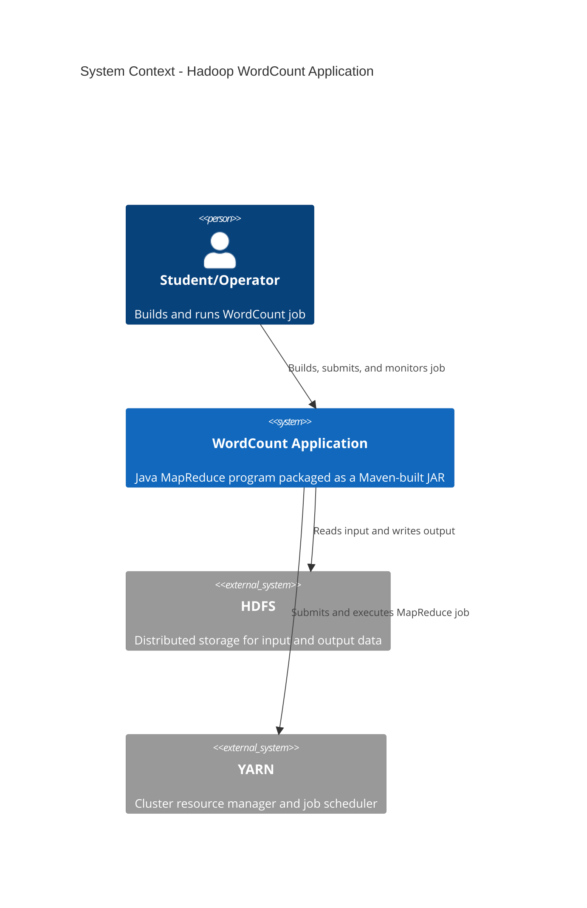
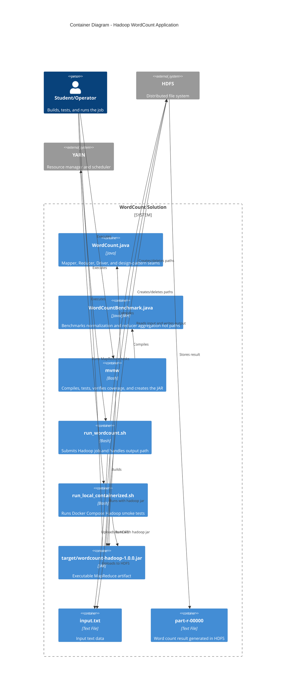
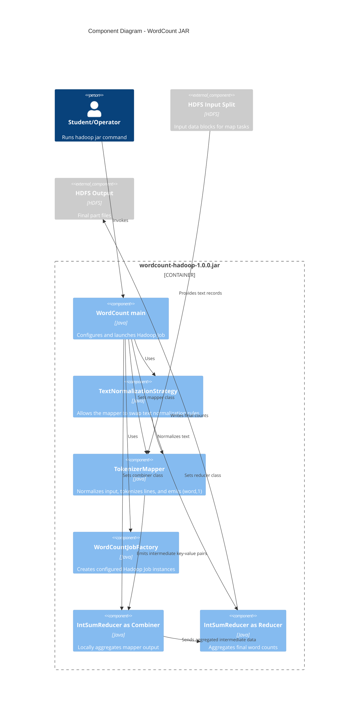

# C4 Documentation - Hadoop WordCount Application

This document provides C4 architecture diagrams for the Java WordCount MapReduce application and its local validation tooling.

## Level 1: System Context



## Level 2: Container Diagram



## Level 3: Component Diagram



## Level 4: Deployment Diagram

```mermaid
flowchart TB
  %% 4-Node Hadoop Cluster deployment (renderable Mermaid)
  subgraph cluster["4-Node Hadoop Cluster (Hadoop runtime)"]
    subgraph master["NameNode (master) — Linux VM\nHDFS NameNode · YARN ResourceManager · client tools"]
      cli[Hadoop Client Shell<br/>Bash<br/>(runs job commands)]
      jar[wordcount-hadoop-1.0.0.jar<br/>JAR (packaged app)]
    end

    subgraph s1["slave1 — Linux VM\nDataNode + NodeManager"]
      map1[Map Task Executor<br/>JVM]
      red1[Reduce Task Executor<br/>JVM]
    end

    subgraph s2["slave2 — Linux VM\nDataNode + NodeManager"]
      map2[Map Task Executor<br/>JVM]
      red2[Reduce Task Executor<br/>JVM]
    end

    subgraph s3["slave3 — Linux VM\nDataNode + NodeManager"]
      map3[Map Task Executor<br/>JVM]
      red3[Reduce Task Executor<br/>JVM]
    end
  end

  devbox["Developer Workstation<br/>macOS / Linux"]
  mvnw[\"mvnw / build scripts\"<br/>(build, test, package)]
  bench[run_benchmarks.sh<br/>JMH bench harness]
  localTest[run_local_containerized.sh<br/>Docker Compose smoke test]

  hdfs["HDFS (distributed storage)\nNameNode / DataNodes"]
  yarn["YARN (cluster services)\nResourceManager / NodeManagers"]

  %% Relationships
  devbox -->|Runs| mvnw
  devbox -->|Runs| bench
  devbox -->|Runs| localTest

  cli -->|Launches| jar
  jar -->|Submits application| yarn

  yarn -->|Schedules containers| map1
  yarn --> map2
  yarn --> map3

  map1 -->|Reads input blocks| hdfs
  map2 -->|Reads input blocks| hdfs
  map3 -->|Reads input blocks| hdfs

  red1 -->|Writes output| hdfs
  red2 -->|Writes output| hdfs
  red3 -->|Writes output| hdfs
```
